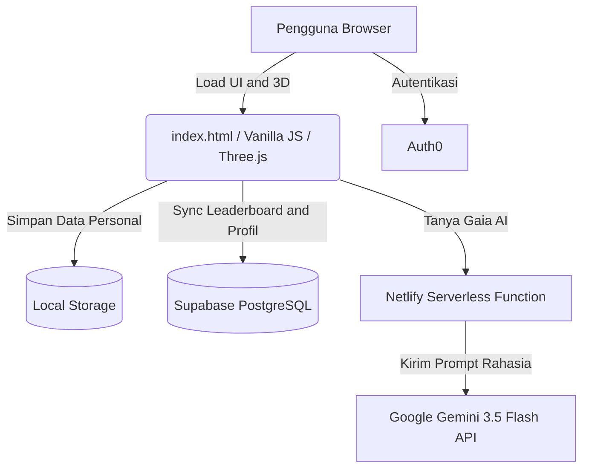

# 🌍 CostingCarbon — Carbon Resource Planner

> *"Kita tidak mewarisi Bumi dari nenek moyang kita — kita meminjamnya dari anak cucu kita."*
> — Antoine de Saint-Exupéry

**CostingCarbon** adalah aplikasi perencanaan jejak karbon berbasis web yang dirancang untuk membantu pengguna memahami, melacak, dan mengurangi emisi CO₂e harian mereka secara nyata dan bermakna. Dibangun dengan filosofi bahwa data yang akurat, visualisasi yang hidup, dan pendampingan yang cerdas dapat mengubah kebiasaan, mengarahkannya pada penyelamatan lingkungan, sekaligus menjadi kontribusi nyata terhadap agenda pembangunan berkelanjutan global.

---

## 🚀 Demo Website

**Live Demo:** https://costingcarbon.netlify.app/

---

## 📌 Latar Belakang & Permasalahan

Dalam menghadapi krisis iklim global, banyak individu menyadari pentingnya mengurangi jejak karbon. Namun, terdapat beberapa masalah utama yang sering dihadapi:

1. **Kurangnya Pemahaman Visual & Nyata:** Emisi karbon adalah hal yang tidak terlihat (*invisible*). Pengguna kesulitan membayangkan seberapa besar dampak dari aktivitas harian mereka terhadap lingkungan.
2. **Kurangnya Personalisasi & Perencanaan:** Kebanyakan kalkulator karbon hanya bersifat statis dan memberikan angka akhir tanpa kemampuan merencanakan anggaran emisi (*budgeting*) ke depan.
3. **Isolasi & Kurangnya Motivasi:** Menurunkan jejak karbon sering kali terasa seperti perjuangan sendirian tanpa ada apresiasi, gamifikasi, atau dukungan komunitas, padahal perubahan iklim adalah persoalan kolektif yang membutuhkan gerakan bersama, bukan hanya usaha individu yang terisolasi.
4. **Kesulitan Mendapatkan Edukasi Instan:** Mencari tahu dampak spesifik dari suatu tindakan sering kali membutuhkan riset yang membosankan dan panjang di internet.

Keempat masalah ini pada dasarnya adalah satu pola besar yang sama: **jarak (*gap*) antara kesadaran individu dan aksi iklim yang terukur.** Di sinilah letak titik temu antara persoalan sehari-hari pengguna dan agenda global **Sustainable Development Goals (SDGs)** — bahwa satu insight yang tepat, disampaikan dengan cara yang personal dan berdampak, dapat menjadi pemicu satu aksi nyata yang berkelanjutan.

---

## 🎯 Subtema Proyek: Lingkungan

Manajemen Anggaran Karbon Personal Berbasis Perilaku (*Behavior-Driven Personal Carbon Budgeting*)

Kami mengangkat subtema Lingkungan (SDG 13) dengan pendekatan inovatif spesifik yaitu Manajemen Anggaran Karbon Personal Berbasis Perilaku, sebuah terobosan yang menggabungkan aspek Smart City (SDG 11) dan inovasi digital (SDG 9).

**CostingCarbon** mengangkat subtema **"Manajemen Anggaran Karbon Personal Berbasis Perilaku"**, yaitu: sama seperti Anda melacak pengeluaran uang agar tidak boncos, kami membantu Anda melacak "pengeluaran karbon" agar bumi tidak "boncos". Subtema ini dipilih karena secara langsung menjawab akar masalah di atas: mengubah krisis iklim yang abstrak dan berskala planet menjadi keputusan-keputusan kecil yang konkret dan dapat dikendalikan oleh satu orang, dalam satu hari.

Pendekatan ini menjadi jembatan yang menghubungkan aksi individu dengan empat tujuan pembangunan berkelanjutan (SDGs) berikut:

| SDG | Peran dalam CostingCarbon |
|---|---|
| **SDG 13 — Penanganan Perubahan Iklim** *(Inti Utama)* | Setiap fitur inti aplikasi — Activity Logger, Carbon Bank Balance, hingga Carbon Futures Biome — dirancang untuk menurunkan jejak karbon harian pengguna secara nyata dan terukur. |
| **SDG 7 — Energi Bersih dan Terjangkau** *(Inti Utama)* | Kategori Energi dalam Budget Planner mendorong kesadaran konsumsi listrik rumah tangga (berbasis faktor emisi ESDM RI 2022), mengarahkan pengguna pada kebiasaan hemat dan sadar energi bersih. |
| **SDG 11 — Kota dan Permukiman yang Berkelanjutan** *(Pendukung Kuat)* | Fitur Community Forest, Leaderboard, dan tantangan berbasis komunitas mendorong perubahan kebiasaan kolektif di lingkungan perkotaan — mulai dari mobilitas hingga konsumsi rumah tangga. |
| **SDG 9 — Industri, Inovasi, dan Infrastruktur** *(Pilar Pendukung)* | Pemanfaatan teknologi mutakhir (visualisasi 3D real-time, AI generatif, arsitektur serverless) menjadi bukti bahwa inovasi teknologi dapat menjadi infrastruktur pendukung aksi iklim yang inklusif dan mudah diakses siapa saja. |

---

## 💡 Solusi yang Diberikan

**CostingCarbon** memecahkan masalah tersebut dengan pendekatan interaktif dan integratif, sekaligus menghidupkan keempat SDG di atas dalam satu pengalaman digital yang menyatu:

1. **Visualisasi Lingkungan 3D** (mendukung SDG 13): Menggunakan model Bumi 3D dan *Carbon Futures Biome* yang merespons secara *real-time* terhadap batas karbon pengguna, mengubah angka emisi menjadi dampak visual yang emosional (dari ekosistem yang subur menjadi gurun berpolusi) — menjembatani jarak antara data abstrak dan aksi iklim nyata.
2. **Perencanaan Anggaran Karbon Interaktif** (mendukung SDG 13 & SDG 7): Memberikan pengguna kendali penuh untuk mengalokasikan anggaran harian (berdasarkan target ilmiah 6,8 kg CO₂e/hari) melintasi 5 kategori aktivitas (Transportasi, Makanan, Energi, Digital, Sampah), termasuk kesadaran konsumsi energi bersih.
3. **Gamifikasi & Komunitas Global** (mendukung SDG 11): Menggunakan sistem Tier, Poin, *Achievements* (Pencapaian), dan Leaderboard global yang disinkronkan secara *real-time* menggunakan Supabase untuk memacu kompetisi sehat dan gerakan kolektif menuju kota dan permukiman yang lebih berkelanjutan.
4. **Asisten AI Terintegrasi Gaia** (mendukung SDG 9): Menyematkan AI berbasis Google Gemini yang memahami profil, data, dan riwayat emisi pengguna untuk memberikan edukasi iklim yang presisi, hiper-personal, dan instan bak seorang pakar lingkungan — sebuah bentuk inovasi teknologi yang menjadikan aksi iklim lebih mudah diakses.

---

## 🛠 Metode Pengembangan

Pengembangan aplikasi ini menggunakan metode Agile. Pendekatan ini dipilih karena:

- **Fleksibilitas Tinggi:** Memungkinkan iterasi fitur secara cepat (*rapid prototyping*) berdasarkan evaluasi.
- **Continuous Integration / Continuous Deployment (CI/CD):** Memanfaatkan Netlify Drop dan GitHub untuk mempermudah pembaruan yang terus-menerus tanpa *downtime*.
- **Pengembangan Modular:** Setiap fitur seperti Activity Logger, Leaderboard (Supabase), dan Gaia AI dikembangkan, diuji, dan disempurnakan dalam *sprint* kecil sebelum diintegrasikan secara penuh.
- **Kolaborasi AI-Assisted:** Pengembangan dibantu oleh kecerdasan buatan untuk merancang struktur algoritma yang efisien dan memecahkan hambatan *debugging* secara tangkas, mencerminkan semangat inovasi infrastruktur digital yang selaras dengan SDG 9.

---

## 💻 Teknologi yang Digunakan

Aplikasi ini dibangun dengan *stack* teknologi modern yang ringan dan berkinerja tinggi, sebagai wujud nyata inovasi infrastruktur digital (SDG 9) yang mendukung aksi iklim:

- **Front-End:** Vanilla JavaScript, HTML5, Vanilla CSS (tanpa framework berat seperti React, memastikan beban file hanya ~200KB).
- **3D Rendering Engine:** Three.js r128 (menangani pencahayaan dinamis, partikel *glowing*, rotasi *orbit*, dan model GLB).
- **Autentikasi:** Auth0 SPA JS v2.1.3 (Google OAuth & Email login).
- **Database & Sinkronisasi:** Supabase JS v2 (PostgreSQL berbasis *serverless* untuk papan peringkat dan data profil).
- **Kecerdasan Buatan (AI):** Google Gemini 3.5 Flash API (diproses melalui Netlify Serverless Functions agar kunci API aman).
- **Hosting & Deployment:** Netlify (menyediakan CDN global dan backend *serverless*).

---

## 🏛 Arsitektur Sistem

Berikut adalah arsitektur sederhana bagaimana sistem CostingCarbon bekerja:

**Penjelasan Arsitektur:**

1. **Front-End (Browser):** Semua aset grafis (HTML/JS/Model 3D) dimuat dari server CDN Netlify. Penyimpanan status aktivitas harian disimpan secara presisi di *Local Storage* per perangkat.
2. **Back-End (API & Database):** Papan peringkat dan sinkronisasi skor komunitas dikelola oleh Supabase, menopang dimensi komunitas perkotaan (SDG 11) dari aplikasi ini. Data profil pengguna (poin, avatar, bio, total emisi yang dihemat, pencapaian) ditarik dan disinkronkan ke sini. Modul AI (Gaia) menggunakan Netlify Functions (`netlify/functions/gaia.js`), yang memastikan API Key Google Gemini tersimpan aman di server Netlify sebagai *Environment Variables*, mencegah kebocoran kunci di sisi *client*.

---

## ✨ Fitur dan Fungsi Web

### Bumi 3D Interaktif *(SDG 13)*
Visualisasi Bumi real-time menggunakan tekstur NASA. Atmosfer Bumi berubah warna sesuai tingkat emisi CO₂e harian pengguna, dari putih bersih hingga merah kritis. Lima orb 3D (Castle, Sakura, Crab, Chest, Ship) mengambang mengelilingi Bumi sebagai panel fitur.

### Activity Logger *(SDG 13 & SDG 7)*
Pencatatan aktivitas harian presisi (dalam hitungan km, kWh, jam, dan gram) menggunakan faktor emisi dari DEFRA 2023, Poore & Nemecek, dan ESDM RI 2022. Setiap aktivitas langsung memperbarui widget harian, memicu *ripple effect* di UI, dan menambah poin pengguna.

### Dashboard — Carbon Bank Balance *(SDG 13)*
Ringkasan karbon harian dan mingguan, meliputi:

- Gauge karbon harian vs anggaran 6,8 kg.
- Grafik mingguan *Budget vs Actual*.
- Rincian emisi hari ini per kategori (*donut chart*).

### Insights & Gaia AI *(SDG 9)*
- **Scenario Simulator:** Skenario perubahan gaya hidup dengan kutipan inspiratif dari tokoh dunia.
- **Gaia AI:** Asisten AI yang memantau data pengguna secara personal dan menjawab pertanyaan seputar iklim melalui antarmuka *streaming text* seperti mesin ketik.

### Budget Planner & Carbon Futures Biome *(SDG 13 & SDG 7)*
Alokasi anggaran karbon manual ke 5 kategori dengan target harian, termasuk kategori Energi yang mendorong kesadaran konsumsi listrik bersih. **Carbon Futures Biome** adalah simulator *micro-biome* 3D (pulau *low-poly*) yang memvisualisasikan dampak ekologis jangka panjang; biome berkembang secara dinamis (subur dengan hewan vs gersang berpolusi) berdasarkan batas karbon yang direncanakan.

### Community Forest & Public Profile *(SDG 11)*
- Sinkronisasi data ke Supabase secara aktual.
- **Public Profile:** Menampilkan avatar pengguna, total aktivitas, metrik karbon yang dihemat (*kg Saved*), ringkasan Tier, dan lencana pencapaian (*Achievements*) yang dapat dilihat oleh semua orang di Leaderboard.
- 12 tantangan (*challenges*) dan 12 pencapaian yang terhubung dengan kontribusi nyata, mendorong budaya kolektif menuju permukiman yang lebih berkelanjutan.

### Profil & Sistem Tier
Profil pengguna dengan sistem progres 5 tier yang mencerminkan perjalanan kesadaran lingkungan:

| Tier | Nama | Poin | Julukan |
|---|---|---|---|
| 1 | Explorer | 0 | The Lone Voyager |
| 2 | Guardian | 20 | The Orbital Sentry |
| 3 | Ecologist | 60 | The Bio-Terraformer |
| 4 | Atmosphere Architect | 80 | The Stellar Designer |
| 5 | Earth Sovereign | 100 | The Galactic Source |

---

## 🔬 Validasi Ilmiah

### Anggaran Harian 6,8 kg CO₂e/hari
Berangkat dari Paris Agreement (2015) (target 1,5°C) dan laporan IPCC AR6: emisi global per kapita perlu turun ke sekitar 2,5 ton per tahun (2.500 kg ÷ 365 hari ≈ 6,8 kg/hari). Angka ini menjadi dasar ilmiah yang menghubungkan target aksi iklim global (SDG 13) dengan keputusan personal harian pengguna.

### Faktor Emisi Transportasi (kg CO₂e per km)

| Moda | Faktor Emisi | Sumber |
|---|---|---|
| Mobil bensin | 0,192 kg/km | DEFRA GHG 2023 |
| Sepeda motor | 0,114 kg/km | DEFRA 2023 |
| Bus | 0,089 kg/km | DEFRA 2023 |

### Faktor Emisi Makanan (kg CO₂e per gram)

| Bahan | Faktor Emisi | Sumber |
|---|---|---|
| Daging sapi | 0,027 kg/g | Poore & Nemecek (2018), *Science* |
| Ayam | 0,0069 kg/g | Poore & Nemecek (2018) |
| Vegan | 0,0019 kg/g | Our World in Data, 2020 |

### Faktor Emisi Energi (kg CO₂e per kWh)

| Sumber Energi | Faktor Emisi | Sumber |
|---|---|---|
| Listrik PLN (Indonesia) | 0,781 kg/kWh | ESDM RI 2022 |

Faktor ini secara langsung mendukung SDG 7, menjadikan konsumsi energi rumah tangga sebagai salah satu variabel yang dapat direncanakan dan dikurangi pengguna dari waktu ke waktu.

### Formula kgSaved
Metrik akumulasi karbon yang berhasil dihemat dibandingkan anggaran harian:

`kgSaved = Σ max(0, DAILY_BUDGET − emisi_harian)`

Hari yang melebihi anggaran tidak mengurangi total (metrik penghargaan, bukan hukuman).

---

## 🌱 Visi

CostingCarbon lahir dari keyakinan sederhana: bahwa kesadaran yang nyata, bukan rasa bersalah, bukan angka abstrak, tapi pemahaman yang hidup dan personal, adalah langkah pertama menuju perubahan. Setiap log aktivitas adalah percakapan kecil antara seseorang dan planetnya, dan Gaia ada di sana, mendengarkan, siap membantu siapa pun yang mau bertanya.

Kami percaya bahwa satu insight yang tepat dapat memicu satu aksi yang berdampak, dan ketika aksi-aksi kecil ini terjadi secara kolektif, di ribuan rumah dan ribuan kota, itulah titik di mana aksi iklim (SDG 13), energi bersih (SDG 7), permukiman berkelanjutan (SDG 11), dan inovasi teknologi (SDG 9) berhenti menjadi agenda global yang jauh, dan mulai menjadi kebiasaan sehari-hari yang nyata.

---

## Kredit

Dibangun bersama, baris demi baris, dengan penuh kepedulian terhadap planet yang kita pinjam dari generasi yang akan datang.

Dibuat oleh **Neo Tanju Allabib**, **Faris Mahendra Sakti**, dan **Jaya Musyafa Surya Sudrajat**.
